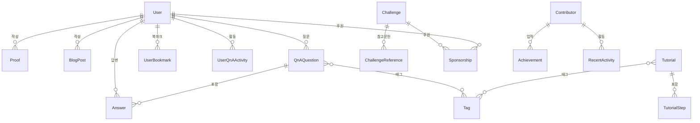

# ShannonManifold — 데이터 스키마 참고서

> 백엔드 & DB 설계 시 참고할 프론트엔드 데이터 인터페이스 총정리

## 📂 데이터 파일 목록

| # | 파일 | 도메인 | 설명 |
|---|------|--------|------|
| 1 | [proofs.ts](file:///Users/iinsu/Documents/GitHub/Prontendfigma/src/app/data/proofs.ts) | 증명 | 수학 정리 및 LaTeX 증명 |
| 2 | [contributors.ts](file:///Users/iinsu/Documents/GitHub/Prontendfigma/src/app/data/contributors.ts) | 기여자 | 커뮤니티 기여자 프로필 |
| 3 | [blogPosts.ts](file:///Users/iinsu/Documents/GitHub/Prontendfigma/src/app/data/blogPosts.ts) | 블로그 | 마크다운 기반 블로그 포스트 |
| 4 | [questions.ts](file:///Users/iinsu/Documents/GitHub/Prontendfigma/src/app/data/questions.ts) | Q&A | 질문, 답변, 태그, 채택 |
| 5 | [tutorials.ts](file:///Users/iinsu/Documents/GitHub/Prontendfigma/src/app/data/tutorials.ts) | 튜토리얼 | 인터랙티브 학습 단계 |
| 6 | [challenges.ts](file:///Users/iinsu/Documents/GitHub/Prontendfigma/src/app/data/challenges.ts) | 난제 | 밀레니엄 난제 및 후원 |
| 7 | [users.ts](file:///Users/iinsu/Documents/GitHub/Prontendfigma/src/app/data/users.ts) | 사용자 | 회원 프로필, 활동, 북마크 |
| 8 | [index.ts](file:///Users/iinsu/Documents/GitHub/Prontendfigma/src/app/data/index.ts) | — | 전체 re-export 인덱스 |

---

## 1. Proof (증명)

```typescript
interface Proof {
  id: string;              // PK, URL slug
  title: string;           // 정리 이름
  category: string;        // 수학 분야 (해석학, 대수학 등)
  difficulty: "초급" | "중급" | "고급";
  author: string;          // FK → User.name
  date: string;            // 작성일
  status: "검증됨" | "검토중" | "초안";
  likes: number;
  comments: number;
  description: string;     // 짧은 설명
  proofSystem: string;     // Lean 4, Coq, Isabelle, Agda
  latex: string;           // LaTeX 본문 (full proof)
  leanCode: string;        // Lean 4 소스 코드
}
```

---

## 2. Contributor (기여자)

```typescript
interface Contributor {
  id: string;              // PK, URL slug
  name: string;
  initial: string;         // 아바타 이니셜
  role: string;            // 직함/소속
  field: string;           // 전문 분야
  bio: string;
  badge: string;           // 칭호 (예: "Top Contributor")
  proofs: number;
  answers: number;
  reputation: number;
  joinDate: string;
  languages: string[];     // 사용 언어/도구
  achievements: { icon: string; label: string }[];
  recentActivity: { type: string; title: string; date: string }[];
}
```

---

## 3. BlogPost (블로그)

```typescript
interface BlogPost {
  id: string;              // PK, URL slug
  title: string;
  excerpt: string;         // 미리보기 요약
  author: string;          // FK → User.name
  date: string;
  readTime: string;        // 읽는 시간 (예: "8분")
  category: string;        // 카테고리 (튜토리얼, 연구 등)
  image: string;           // 히어로 이미지 URL
  content: string;         // Markdown 본문
}
```

---

## 4. QnAQuestion (질문/답변)

```typescript
interface QnAQuestion {
  id: string;              // PK, URL slug
  title: string;
  description: string;     // 짧은 요약
  author: string;          // FK → User.name
  date: string;
  views: number;
  answers: number;         // 답변 수 (denormalized)
  likes: number;
  tags: string[];          // 태그 배열
  status: "answered" | "open";
  content: string;         // Markdown 본문
  answerList: Answer[];
}

interface Answer {
  author: string;          // FK → User.name
  date: string;
  content: string;         // Markdown 본문
  likes: number;
  accepted: boolean;       // 채택 여부
}
```

---

## 5. Tutorial (튜토리얼)

```typescript
interface Tutorial {
  id: string;              // PK, URL slug
  title: string;
  description: string;
  level: "입문" | "중급" | "고급";
  duration: string;        // 예상 소요 시간 (예: "4주")
  lessons: number;         // 총 레슨 수
  icon: string;            // 수학 기호 (∀, ∫ 등)
  author: string;          // FK → User.name
  updatedAt: string;
  prerequisites: string[]; // FK → Tutorial.id
  tags: string[];
  steps: TutorialStep[];
}

interface TutorialStep {
  title: string;
  description: string;
  explanation: string;     // 개념 설명
  starterCode: string;     // 초기 Lean 코드
  solution: string;        // 정답 코드
  hint: string;            // 힌트
}
```

---

## 6. Challenge (난제)

```typescript
interface Challenge {
  id: string;              // PK, URL slug
  title: string;
  field: string;           // 수학 분야
  description: string;
  prize: string;           // 상금 (예: "$1,000,000")
  sponsorPool: string;     // 적립된 후원금
  backers: number;         // 후원자 수
  progress: number;        // 후원 진행률 (0~100)
  difficulty: "Millennium" | "Hard" | "Medium";
  proofSystem: string;
  accent: string;          // UI용 그라디언트 클래스
  createdAt: string;
  updatedAt: string;
  detailedDescription: string;
  references: { title: string; url: string }[];
  verificationCriteria: string[];
}
```

---

## 7. User (사용자)

```typescript
interface UserProfile {
  id: string;              // PK
  name: string;            // 표시 이름
  email: string;           // UNIQUE
  avatarUrl: string | null;
  bio: string;
  system: string;          // 주 사용 증명 보조기
  joinDate: string;
  role: "member" | "moderator" | "admin";
  stats: {                 // denormalized 통계
    proofs: number;
    answers: number;
    likes: number;
    points: number;
  };
  notifications: {         // 알림 설정
    email: boolean;
    answer: boolean;
    like: boolean;
    challenge: boolean;
  };
}

// 연관 엔티티
interface UserProof      { /* 사용자의 증명 목록 */ }
interface UserQnAActivity { /* 사용자의 Q&A 활동 */ }
interface UserBookmark    { /* 사용자의 북마크 */ }
```

---

## 🔗 엔티티 관계도



---

## 💾 DB 추천

> [!IMPORTANT]
> 이 프로젝트의 데이터 특성을 고려한 DB 추천입니다.

### 추천: **PostgreSQL** 🐘

| 이유 | 설명 |
|------|------|
| **관계형 데이터** | User ↔ Proof ↔ Q&A ↔ Answer 등 엔티티 간 관계가 명확함 |
| **JSON 지원** | `achievements`, `recentActivity` 같은 유연한 필드는 `jsonb` 컬럼으로 처리 |
| **전문 검색** | Q&A, 블로그, 증명 검색에 `tsvector` 기반 한국어 전문 검색 활용 가능 |
| **성숙한 생태계** | ORM(Prisma, Drizzle), 마이그레이션 도구 풍부 |
| **무료 호스팅** | Supabase, Neon, Railway 등에서 무료 티어 제공 |

### ORM 추천

| 옵션 | 특징 |
|------|------|
| **Prisma** | 타입 안전, 직관적 스키마 정의, 마이그레이션 자동화 |
| **Drizzle** | 경량, SQL에 가까운 인터페이스, 번들 크기 작음 |

### 대안 고려

| DB | 적합한 경우 |
|----|------------|
| **MongoDB** | 스키마가 자주 바뀌거나 비정형 데이터가 많을 때 |
| **Supabase (PostgreSQL + BaaS)** | 인증, 실시간, 스토리지를 한번에 해결하고 싶을 때 |
| **PlanetScale (MySQL)** | 수평 확장이 중요할 때 |

> [!TIP]
> **가장 빠른 시작**: Supabase를 사용하면 PostgreSQL + 인증(Auth) + 실시간(Realtime) + 파일 스토리지를 한 번에 얻을 수 있어, 별도 백엔드 없이도 프론트에서 직접 연동할 수 있습니다. 현재 프로젝트의 로그인/회원가입 기능과도 바로 맞물립니다.

---

## 🗒️ 다음 단계

1. **DB 선택 확정** → PostgreSQL(직접) vs Supabase(BaaS) 결정
2. **ORM 선택** → Prisma vs Drizzle
3. **스키마 마이그레이션** → 위 인터페이스를 기반으로 테이블 생성
4. **API 엔드포인트 설계** → REST 또는 tRPC
5. **프론트 데이터 레이어 교체** → mock 데이터 → API fetch 전환
